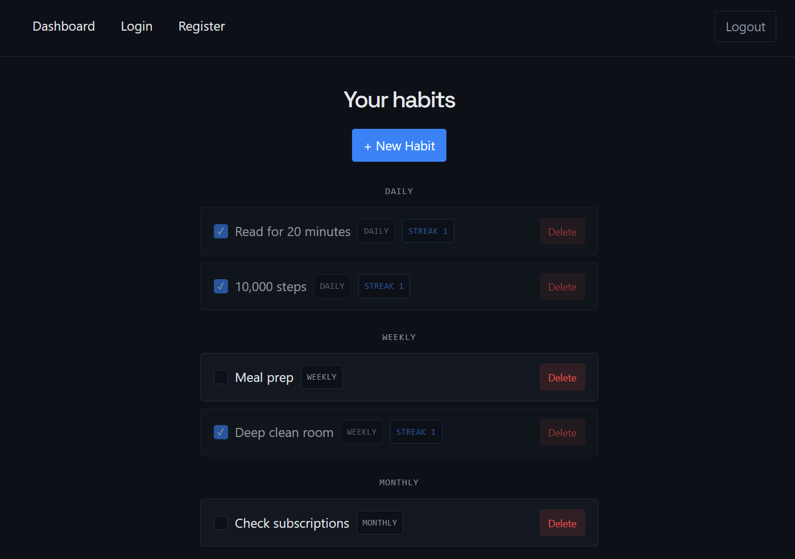
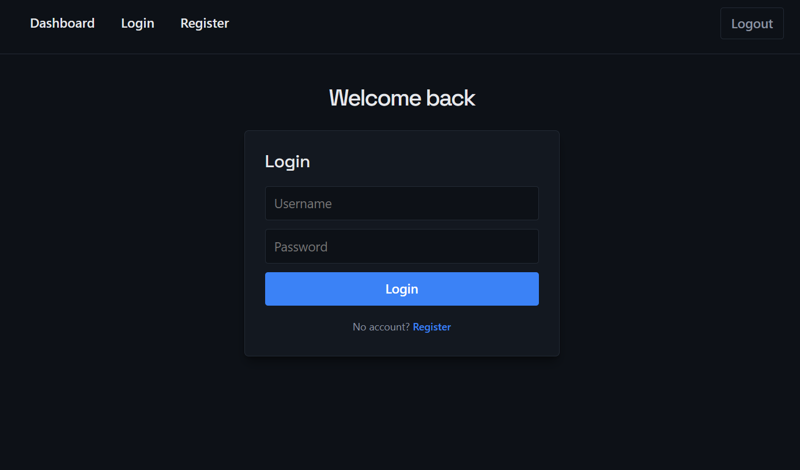

# Habit Tracker

A React + TypeScript frontend for tracking personal habits. Register, log in, and manage your own habits — create, group by frequency, mark complete (with streak tracking), and delete. Talks to a separate FastAPI backend ([habit-tracker-api](https://github.com/xAlayham/habit-tracker-api)) over a JWT-authenticated REST API.

**Live demo:** https://habit-tracker-web-alpha.vercel.app

## Screenshots

|                     Dashboard                      |                    Login                     |
| :------------------------------------------------: | :------------------------------------------: |
|         |          |

## Features

- Register / log in with JWT auth, token persisted in `localStorage`
- Protected routes — the dashboard redirects to login if you're not authenticated
- Full CRUD on habits, grouped into Daily / Weekly / Monthly / Yearly sections
- Mark a habit complete for the current period, with streak tracking that resets correctly across day/week/month/year boundaries
- Client- and server-side input validation, with real error messages instead of silent failures

## Tech Stack

- **React 19** + **TypeScript**
- **Vite** — build tool / dev server
- **React Router** — client-side routing, including a protected-route wrapper
- Plain CSS (no framework) — dark theme, CSS custom properties for theming

## Setup

From a fresh clone:

```bash
cd frontend

# 1. Install dependencies
npm install

# 2. Set up environment variables
cp .env.example .env
# .env already points at http://127.0.0.1:8000 by default, which matches
# the companion API's local dev server — change it if your API runs elsewhere

# 3. Run the dev server
npm run dev
```

The app will be available at `http://localhost:5173`.

**Note:** this frontend doesn't do anything on its own — it needs [habit-tracker-api](https://github.com/xAlayham/habit-tracker-api) running (locally or deployed) to actually register/log in/manage habits.

## Building for production

```bash
npm run build
```

Outputs a static build to `frontend/dist`. Set `VITE_API_URL` to your deployed API's URL at build time (e.g. as an environment variable in your hosting provider) so the production build points at the real backend instead of localhost.

## Deployment

Deployed on Vercel (frontend) and Render (API). Root directory on Vercel is set to `frontend`, since the Vite project lives in a subfolder of this repo rather than at the repo root.

## Known limitations

Deliberate trade-offs and rough edges, documented rather than hidden:

- **The JWT is stored in `localStorage`.** This is simple and works well for a SPA talking to a separate API, but it means any successful XSS attack can read the token and impersonate the user. The more secure alternative is an `httpOnly` cookie, which JavaScript can't read at all — that shifts the risk to CSRF instead (mitigated with `SameSite` and/or CSRF tokens) and requires the API to manage cookies and CORS credentials rather than just reading an `Authorization` header. For a demo app with no sensitive data, `localStorage` was the reasonable call; for anything handling real user data, the cookie approach is the right one.
- **No token refresh or expiry handling.** Access tokens expire after 30 minutes. The route guard only checks that a token *exists*, not that it's still valid — so once it expires, you stay on the dashboard and see an error instead of being redirected back to login. A refresh-token flow, or decoding the token's `exp` client-side, would fix this.
- **Render's free tier sleeps.** The API spins down after inactivity, so the first request after an idle period can take 30–60 seconds while it wakes up.
- **SQLite on ephemeral storage.** The deployed API's database lives on Render's ephemeral filesystem, so data can reset on redeploy. Fine for a demo; a hosted Postgres instance would be the fix for anything persistent.
